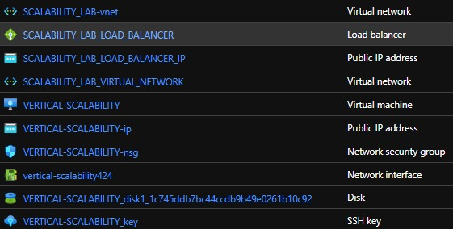
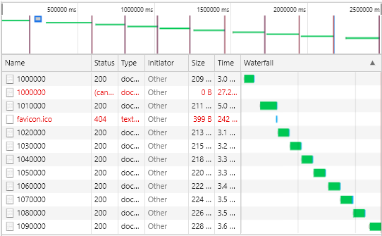
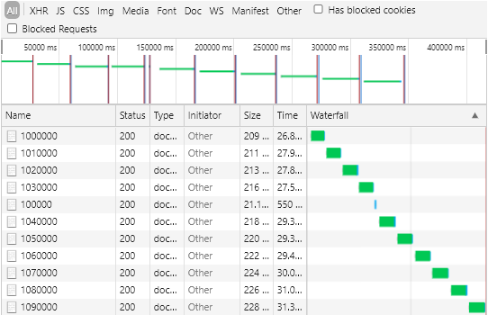
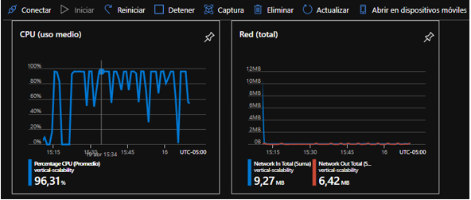
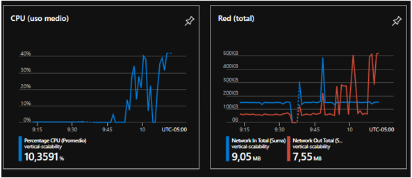
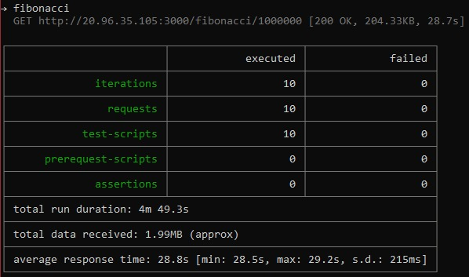
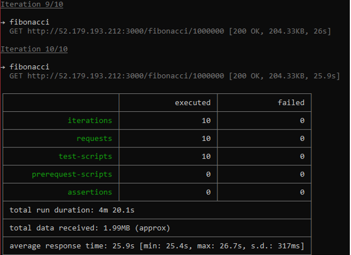
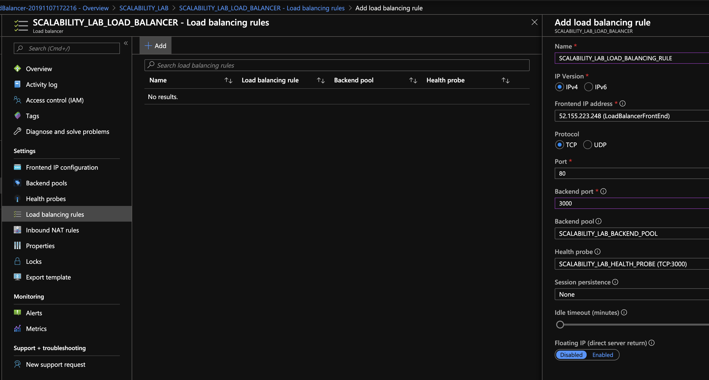
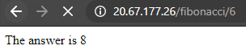

### Escuela Colombiana de Ingeniería
### Arquitecturas de Software - ARSW

## Escalamiento en Azure con Maquinas Virtuales, Sacale Sets y Service Plans

### Dependencias
* Cree una cuenta gratuita dentro de Azure. Para hacerlo puede guiarse de esta [documentación](https://azure.microsoft.com/en-us/free/search/?&ef_id=Cj0KCQiA2ITuBRDkARIsAMK9Q7MuvuTqIfK15LWfaM7bLL_QsBbC5XhJJezUbcfx-qAnfPjH568chTMaAkAsEALw_wcB:G:s&OCID=AID2000068_SEM_alOkB9ZE&MarinID=alOkB9ZE_368060503322_%2Bazure_b_c__79187603991_kwd-23159435208&lnkd=Google_Azure_Brand&dclid=CjgKEAiA2ITuBRDchty8lqPlzS4SJAC3x4k1mAxU7XNhWdOSESfffUnMNjLWcAIuikQnj3C4U8xRG_D_BwE). Al hacerlo usted contará con $200 USD para gastar durante 1 mes.

### Parte 0 - Entendiendo el escenario de calidad

Adjunto a este laboratorio usted podrá encontrar una aplicación totalmente desarrollada que tiene como objetivo calcular el enésimo valor de la secuencia de Fibonnaci.

**Escalabilidad**
Cuando un conjunto de usuarios consulta un enésimo número (superior a 1000000) de la secuencia de Fibonacci de forma concurrente y el sistema se encuentra bajo condiciones normales de operación, todas las peticiones deben ser respondidas y el consumo de CPU del sistema no puede superar el 70%.

### Parte 1 - Escalabilidad vertical

1. Diríjase a el [Portal de Azure](https://portal.azure.com/) y a continuación cree una maquina virtual con las características básicas descritas en la imágen 1 y que corresponden a las siguientes:
    * Resource Group = SCALABILITY_LAB
    * Virtual machine name = VERTICAL-SCALABILITY
    * Image = Ubuntu Server 
    * Size = Standard B1ls
    * Username = scalability_lab
    * SSH publi key = Su llave ssh publica


2. Para conectarse a la VM use el siguiente comando, donde las `x` las debe remplazar por la IP de su propia VM.

    `ssh scalability_lab@xxx.xxx.xxx.xxx`

3. Instale node, para ello siga la sección *Installing Node.js and npm using NVM* que encontrará en este [enlace](https://linuxize.com/post/how-to-install-node-js-on-ubuntu-18.04/).
4. Para instalar la aplicación adjunta al Laboratorio, suba la carpeta `FibonacciApp` a un repositorio al cual tenga acceso y ejecute estos comandos dentro de la VM:

    `git clone <your_repo>`

    `cd <your_repo>/FibonacciApp`

    `npm install`

5. Para ejecutar la aplicación puede usar el comando `npm FibinacciApp.js`, sin embargo una vez pierda la conexión ssh la aplicación dejará de funcionar. Para evitar ese compartamiento usaremos *forever*. Ejecute los siguientes comando dentro de la VM.

    `npm install forever -g`

    `forever start FibinacciApp.js`

6. Antes de verificar si el endpoint funciona, en Azure vaya a la sección de *Networking* y cree una *Inbound port rule* tal como se muestra en la imágen. Para verificar que la aplicación funciona, use un browser y user el endpoint `http://xxx.xxx.xxx.xxx:3000/fibonacci/6`. La respuesta debe ser `The answer is 8`.


7. La función que calcula en enésimo número de la secuencia de Fibonacci está muy mal construido y consume bastante CPU para obtener la respuesta. Usando la consola del Browser documente los tiempos de respuesta para dicho endpoint usando los siguintes valores:
    * 1000000
    * 1010000
    * 1020000
    * 1030000
    * 1040000
    * 1050000
    * 1060000
    * 1070000
    * 1080000
    * 1090000    

8. Dírijase ahora a Azure y verifique el consumo de CPU para la VM. (Los resultados pueden tardar 5 minutos en aparecer).


9. Ahora usaremos Postman para simular una carga concurrente a nuestro sistema. Siga estos pasos.
    * Instale newman con el comando `npm install newman -g`. Para conocer más de Newman consulte el siguiente [enlace](https://learning.getpostman.com/docs/postman/collection-runs/command-line-integration-with-newman/).
    * Diríjase hasta la ruta `FibonacciApp/postman` en una maquina diferente a la VM.
    * Para el archivo `[ARSW_LOAD-BALANCING_AZURE].postman_environment.json` cambie el valor del parámetro `VM1` para que coincida con la IP de su VM.
    * Ejecute el siguiente comando.

    ```
    newman run ARSW_LOAD-BALANCING_AZURE.postman_collection.json -e [ARSW_LOAD-BALANCING_AZURE].postman_environment.json -n 10 &
    newman run ARSW_LOAD-BALANCING_AZURE.postman_collection.json -e [ARSW_LOAD-BALANCING_AZURE].postman_environment.json -n 10
    ```

10. La cantidad de CPU consumida es bastante grande y un conjunto considerable de peticiones concurrentes pueden hacer fallar nuestro servicio. Para solucionarlo usaremos una estrategia de Escalamiento Vertical. En Azure diríjase a la sección *size* y a continuación seleccione el tamaño `B2ms`.


11. Una vez el cambio se vea reflejado, repita el paso 7, 8 y 9.
12. Evalue el escenario de calidad asociado al requerimiento no funcional de escalabilidad y concluya si usando este modelo de escalabilidad logramos cumplirlo.
13. Vuelva a dejar la VM en el tamaño inicial para evitar cobros adicionales.

**Preguntas**

1. ¿Cuántos y cuáles recursos crea Azure junto con la VM?





2. ¿Brevemente describa para qué sirve cada recurso?

**Virtual network:** Es una representación de su propia red en la nube. Es un aislamiento lógico de la nube de Azure dedicada a su suscripción. 

**Load Balancer:** El equilibrio de carga se refiere a distribuir uniformemente la carga (tráfico de red entrante) en un grupo de servidores o recursos de back-end.

**Public IP address:** Las direcciones IP públicas permiten que los recursos de Internet se comuniquen de forma entrante a los recursos de Azure. Las direcciones IP públicas 
permiten que los recursos de Azure se comuniquen con Internet y los servicios públicos de Azure.

**Virtual machine:** Es lo que Azure ofrece para alojar la aplicación sin hardware fisico.

**Netowork seguryty group:** Para filtrar el tráfico de red hacia y desde los recursos de Azure en una red virtual de Azure. Un grupo de seguridad de red contiene reglas de seguridad que permiten o deniegan el tráfico de red entrante o el tráfico de red saliente de varios tipos de recursos de Azure. 

**Network interface:** Es una interconexión entre una máquina virtual y la red de software subyacente.

**Disk:** Permiten en almacenamiento de la máquina virtual Azure.

**SSH Key:** Es la que permite que solo el usuario con la llave pueda ingresar a la máquina.


3. ¿Al cerrar la conexión ssh con la VM, por qué se cae la aplicación que ejecutamos con el comando `npm FibonacciApp.js`? ¿Por qué debemos crear un *Inbound port rule* antes de acceder al servicio?
    
    - Al no utilizar el comando 'forever' hace que el script se ejecute de forma continua. Haciendo que cuando se cierre la conexión SSH, este script se deje de ejecutar.
    - Para que tenga acceso al público desde el puerto señalado.

4. Adjunte tabla de tiempos e interprete por qué la función tarda tando tiempo.

Sin escalamiento





Con escalamiento





5. Adjunte imágen del consumo de CPU de la VM e interprete por qué la función consume esa cantidad de CPU.

Sin escalamiento





Con escalamiento





6. Adjunte la imagen del resumen de la ejecución de Postman. Interprete:
    * Tiempos de ejecución de cada petición.
	
Sin escalamiento





Con escalamiento





7. ¿Cuál es la diferencia entre los tamaños `B2ms` y `B1ls` (no solo busque especificaciones de infraestructura)?

	- El disco B1ls tiene de memoria 0.5 GiB y la B2ms tiene 8 GiB, esto permite que el almacenamiento interno sea mayor, el rendimiento de la CPU del disco B2ms es el doble al del disco B1ls. Las mejoras del disco B2ms son mayores y eso se ve reflejado en el consumo de créditos consumidos en comparación a la B1ls.

8. ¿Aumentar el tamaño de la VM es una buena solución en este escenario?, ¿Qué pasa con la FibonacciApp cuando cambiamos el tamaño de la VM?

	- Al tener mas capacidad mejora considerablente la ejecución de la aplicación y hace que las respuestas esten listas en un menor tiempo. 
	- Toca reiniciar la maquina y se suspenderia el servicio.

9. ¿Qué pasa con la infraestructura cuando cambia el tamaño de la VM? ¿Qué efectos negativos implica?

	- La maquina es mas costosa, ya que contiene mas recursos.


10. ¿Hubo mejora en el consumo de CPU o en los tiempos de respuesta? Si/No ¿Por qué?

	- Tuvo un mejoramiento en el consumo de la CPU, puesto que al usarse mas recursos, le facilita a la maquina el proceso.
	
11. Aumente la cantidad de ejecuciones paralelas del comando de postman a `4`. ¿El comportamiento del sistema es porcentualmente mejor?

### Parte 2 - Escalabilidad horizontal

#### Crear el Balanceador de Carga

Antes de continuar puede eliminar el grupo de recursos anterior para evitar gastos adicionales y realizar la actividad en un grupo de recursos totalmente limpio.

1. El Balanceador de Carga es un recurso fundamental para habilitar la escalabilidad horizontal de nuestro sistema, por eso en este paso cree un balanceador de carga dentro de Azure tal cual como se muestra en la imágen adjunta.


2. A continuación cree un *Backend Pool*, guiese con la siguiente imágen.


3. A continuación cree un *Health Probe*, guiese con la siguiente imágen.


4. A continuación cree un *Load Balancing Rule*, guiese con la siguiente imágen.



5. Cree una *Virtual Network* dentro del grupo de recursos, guiese con la siguiente imágen.


#### Crear las maquinas virtuales (Nodos)

Ahora vamos a crear 3 VMs (VM1, VM2 y VM3) con direcciones IP públicas standar en 3 diferentes zonas de disponibilidad. Después las agregaremos al balanceador de carga.

1. En la configuración básica de la VM guíese por la siguiente imágen. Es importante que se fije en la "Avaiability Zone", donde la VM1 será 1, la VM2 será 2 y la VM3 será 3.


2. En la configuración de networking, verifique que se ha seleccionado la *Virtual Network*  y la *Subnet* creadas anteriormente. Adicionalmente asigne una IP pública y no olvide habilitar la redundancia de zona.


3. Para el Network Security Group seleccione "avanzado" y realice la siguiente configuración. No olvide crear un *Inbound Rule*, en el cual habilite el tráfico por el puerto 3000. Cuando cree la VM2 y la VM3, no necesita volver a crear el *Network Security Group*, sino que puede seleccionar el anteriormente creado.


4. Ahora asignaremos esta VM a nuestro balanceador de carga, para ello siga la configuración de la siguiente imágen.


5. Finalmente debemos instalar la aplicación de Fibonacci en la VM. para ello puede ejecutar el conjunto de los siguientes comandos, cambiando el nombre de la VM por el correcto

```
git clone https://github.com/daprieto1/ARSW_LOAD-BALANCING_AZURE.git

curl -o- https://raw.githubusercontent.com/creationix/nvm/v0.34.0/install.sh | bash
source /home/vm1/.bashrc
nvm install node

cd ARSW_LOAD-BALANCING_AZURE/FibonacciApp
npm install

npm install forever -g
forever start FibonacciApp.js
```

Realice este proceso para las 3 VMs, por ahora lo haremos a mano una por una, sin embargo es importante que usted sepa que existen herramientas para aumatizar este proceso, entre ellas encontramos Azure Resource Manager, OsDisk Images, Terraform con Vagrant y Paker, Puppet, Ansible entre otras.

#### Probar el resultado final de nuestra infraestructura

1. Porsupuesto el endpoint de acceso a nuestro sistema será la IP pública del balanceador de carga, primero verifiquemos que los servicios básicos están funcionando, consuma los siguientes recursos:

```
http://52.155.223.248/
http://52.155.223.248/fibonacci/1
```




2. Realice las pruebas de carga con `newman` que se realizaron en la parte 1 y haga un informe comparativo donde contraste: tiempos de respuesta, cantidad de peticiones respondidas con éxito, costos de las 2 infraestrucruras, es decir, la que desarrollamos con balanceo de carga horizontal y la que se hizo con una maquina virtual escalada.

3. Agregue una 4 maquina virtual y realice las pruebas de newman, pero esta vez no lance 2 peticiones en paralelo, sino que incrementelo a 4. Haga un informe donde presente el comportamiento de la CPU de las 4 VM y explique porque la tasa de éxito de las peticiones aumento con este estilo de escalabilidad.

```
newman run ARSW_LOAD-BALANCING_AZURE.postman_collection.json -e [ARSW_LOAD-BALANCING_AZURE].postman_environment.json -n 10 &
newman run ARSW_LOAD-BALANCING_AZURE.postman_collection.json -e [ARSW_LOAD-BALANCING_AZURE].postman_environment.json -n 10 &
newman run ARSW_LOAD-BALANCING_AZURE.postman_collection.json -e [ARSW_LOAD-BALANCING_AZURE].postman_environment.json -n 10 &
newman run ARSW_LOAD-BALANCING_AZURE.postman_collection.json -e [ARSW_LOAD-BALANCING_AZURE].postman_environment.json -n 10
```

**Preguntas**

* ¿Cuáles son los tipos de balanceadores de carga en Azure y en qué se diferencian?, ¿Qué es SKU, qué tipos hay y en qué se diferencian?, ¿Por qué el balanceador de carga necesita una IP pública?

	- **Balanceador de carga interno:** 
		- Equilibre la carga del tráfico entrante de Internet a las máquinas virtuales
		- puede acceder a un servidor front-end de Load Balancer desde una red local en un escenario híbrido.
		- Reenviar el tráfico a un puerto específico de máquinas virtuales determinadas con reglas de traducción de direcciones de red (NAT) de entrada
		- Proporcionar conectividad de salida para máquinas virtuales dentro de la red virtual mediante un equilibrador de carga público
	- **SKU**: Se puede decir que es el número de referencia de un producto; un sistema de identificación esencial para poder realizar cualquier tipo de inventario ya sea físico o financiero y sus tipos son:
		-  **Basico:**  El almacenamiento incluido y el rendimiento de las imágenes son más adecuadas para escenarios de uso inferior.
		-  **Estandar:** Contiene más almacenamiento y un mayor rendimiento de las imágenes.
		-  **Premium:** Proporcionan la mayor cantidad de almacenamiento incluido y operaciones simultáneas, por lo que permiten trabajar con escenarios de mayor volumen. Además de la mayor capacidad de rendimiento de las imágenes, el nivel Premium agrega características tales como replicación geográfica para la administración de un único registro en varias regiones, confianza del contenido para la firma de etiquetas de imagen, y vínculo privado con puntos de conexión privados para restringir el acceso al Registro.
	- **Balanceador de carga con IP pública:** Permite que el sitio web que administremos esté siempre disponible, y sea capaz de servir todas las peticiones a la máxima velocidad posible, al ser una ip pública permite que cualquier usuario se puede conectar a esta.
* ¿Cuál es el propósito del *Backend Pool*?

	- El grupo de backend es un componente crítico del balanceador de carga. El grupo de backend define el grupo de recursos que brindarán tráfico para una regla de equilibrio de carga determinada.

* ¿Cuál es el propósito del *Health Probe*?
	- Determina que instancias del grupo de backend recibirán nuevos flujos. Puede usar Health Probe para detectar la falla de una aplicación en un endpoint de backend. 
* ¿Cuál es el propósito de la *Load Balancing Rule*? ¿Qué tipos de sesión persistente existen, por qué esto es importante y cómo puede afectar la escalabilidad del sistema?.
	- Puede escalar sus aplicaciones y crear servicios de alta disponibilidad. El equilibrador de carga admite escenarios entrantes y salientes. El equilibrador de carga proporciona baja latencia y alto rendimiento, y escala hasta millones de flujos para todas las aplicaciones TCP y UDP.
	- 
* ¿Qué es una *Virtual Network*? ¿Qué es una *Subnet*? ¿Para qué sirven los *address space* y *address range*?
	-  **Virtual Network:** Es el bloque de creación fundamental de una red privada en Azure. VNet permite muchos tipos de recursos de Azure, como Azure Virtual Machines (máquinas virtuales), para comunicarse de forma segura entre usuarios, con Internet y con las redes locales. VNet es similar a una red tradicional que funcionaría en su propio centro de datos, pero aporta las ventajas adicionales de la infraestructura de Azure, como la escala, la disponibilidad y el aislamiento.
	-  **Subnet:** Permite designar una subred concreta para el servicio PaaS de Azure que se prefiera e insertarla en una red virtual. La delegación de subred proporciona al cliente control total al cliente de la administración de la integración de los servicios de Azure en sus redes virtuales.
	-  **address space:** Asigna a los recursos de una red virtual una dirección IP privada desde el espacio de direcciones que usted asigna.
	-  **address range:** Proporciona un rango contiguo de direcciones a su suscripción según la cantidad que especifique
* ¿Qué son las *Availability Zone* y por qué seleccionamos 3 diferentes zonas?. ¿Qué significa que una IP sea *zone-redundant*?
	- Cada región tiene varias ubicaciones aisladas conocidas como zonas de disponibilidad. Cuando lanza una instancia, puede seleccionar una zona de disponibilidad. Si distribuye las instancias entre varias zonas de disponibilidad y una de las 3 instancias genera un error, puede diseñar la aplicación de forma que una instancia en otra zona de disponibilidad pueda gestionar las solicitudes.
	- Los servicios de zone-redundant replican sus aplicaciones y datos a través de las zonas de disponibilidad para protegerlos de los puntos únicos de fallo. Con las zonas de disponibilidad, Azure ofrece el mejor acuerdo de nivel de servicio (SLA) del sector con un 99,99% de tiempo de actividad de las máquinas. El SLA completo de Azure explica la disponibilidad garantizada de Azure en su conjunto. Las puertas de enlace de zone-redundant y las puertas de enlace de zona se basan en el recurso de IP pública de Azure SKU estándar. La configuración del recurso de IP pública de Azure determina si la puerta de enlace que implementa es redundante por zonas o zonal.
* ¿Cuál es el propósito del *Network Security Group*?
	- Puede usar un grupo de seguridad de red de Azure para filtrar el tráfico de red hacia y desde los recursos de Azure en una red virtual de Azure. Un grupo de seguridad de red contiene reglas de seguridad que permiten o deniegan el tráfico de red entrante o el tráfico de red saliente de varios tipos de recursos de Azure. 
* Informe de newman 1 (Punto 2)
* Presente el Diagrama de Despliegue de la solución.


